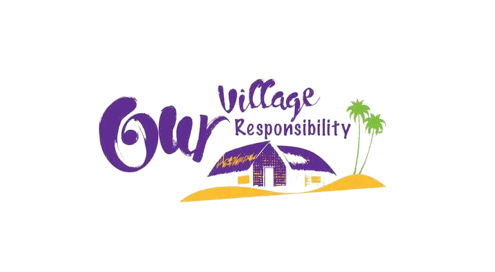

<!DOCTYPE html>
<html lang="en">

<head>
  <meta charset="UTF-8" />
  <meta name="viewport" content="width=device-width, initial-scale=1.0" />
  <meta http-equiv="X-UA-Compatible" content="ie=edge" />
  <!-- bootstrap css -->
  <link rel="stylesheet" href="https://maxcdn.bootstrapcdn.com/bootstrap/4.0.0/css/bootstrap.min.css"
    integrity="sha384-Gn5384xqQ1aoWXA+058RXPxPg6fy4IWvTNh0E263XmFcJlSAwiGgFAW/dAiS6JXm" crossorigin="anonymous">

  <!-- main css -->
  <link rel="stylesheet" href="css/main.css" />
  <!-- google fonts -->
  <link href="https://fonts.googleapis.com/css?family=Courgette" rel="stylesheet" />

  <!-- font awesome -->
  <link rel="stylesheet" href="css/all.css" />
  <title>Our Village Our Responsibility</title>
  
</head>

<body>
  <!--
      https://www.iconfinder.com/icons/185106/armchair_chair_streamline_icon
      Creative Commons (Attribution 3.0 Unported);
      https://www.iconfinder.com/webalys
    -->
  <header class="w-75 mx-auto">
    <nav class="navbar navbar-expand-lg navbar-light">
      <!--
      https://www.iconfinder.com/icons/185106/armchair_chair_streamline_icon
      Creative Commons (Attribution 3.0 Unported);
      https://www.iconfinder.com/webalys
    -->
      
      <!-- .nav-togger, nav-link, nav-active are custom from main.css for nav bar text styles-->
      <button class="navbar-toggler" type="button" data-toggle="collapse" data-target="#ovorNavBar">
        <i class="fas fa-bars"> </i> <!-- nav bar icon-->
      </button>
      

        <ul class="navbar-nav mx-auto">
          <li class="nav-item mx-2 nav-active">
            <a href="index.html" class="nav-link">Home</a>
          </li>
          <li class="nav-item mx-2">
            <a href="about.html" class="nav-link">About</a>
          </li>
          <li class="nav-item mx-2">
            <a href="schoolactivities.html" class="nav-link">School Activities</a>
          </li>
          <li class="nav-item mx-2">
              <a href="news.html" class="nav-link">News</a>
          </li>
        </ul>
      

    </nav>
    <!-- end of nav-->
  </header>

  <section>
    

      

        

          

            

              

                <h1 class="text-capitalize mb-0">minimalist</h1>
                <h1 class="text-uppercase font-weight-bold">interior style</h1>
              

            

          

          

            

              

                <h1 class="text-capitalize mb-0">minimalist</h1>
                <h1 class="text-uppercase font-weight-bold">interior style</h1>
              

            

          

          

            

              

                <h1 class="text-capitalize mb-0">minimalist</h1>
                <h1 class="text-uppercase font-weight-bold">interior style</h1>
              

            

          

        

        <a href="#bannerCarousel" class="carousel-control-prev" role="button" data-slide="prev">
          <i class="fas fa-arrow-left"></i>
        </a>
        <a href="#bannerCarousel" class="carousel-control-next" role="button" data-slide="next">
          <i class="fas fa-arrow-right"></i>
        </a>

      

    

  </section>

  <footer class="bg-dark px-5 w-75 mx-auto">
    

      

        

          <h5 class="pb-3">About</h5>
          
We are a team who are passionate about making things better around us for all of us. Every
            change should start with self,house before working towards bigger picture same with the country, it should
            start with our villages which are the backbone of our existence. It could be schools, libraries,
            electric/water facilities, transportation needs, community centers or anything that benefits the village and
            brings them together. we are starting with schools and hopefully will get to other sectors as well depending
            upon the availability of resources.

          <a href="https://www.facebook.com/ourvillageourresponsibility/" class="mr-2"><i
              class="fab fa-facebook-f"></i></a>
          <a href="#"><i class="fab fa-twitter"></i></a>
        

        

          

            <h5 class="pb-3">Visit</h5>
            <ul class="list-unstyled">
              <li>
                <a href="" class="footer-link">Home</a>
              </li>
              <li>
                <a href="" class="footer-link">About</a>
              </li>
              <li>
                <a href="" class="footer-link">School Activities</a>
              </li>
              <li>
                <a href="" class="footer-link">Village Activities</a>
              </li>
              <li>
                <a href="" class="footer-link">Smart Class</a>
              </li>
            </ul>
          

        

        

          <h5 class="pb-3">Connect With Us</h5>
          <ul class="list-unstyled">
            <li class="mb-2">
              <i class="fas fa-map-marker-alt pr-2"></i>
              Kavitha K Pandian
            </li>
            <li>
              <i class="fas fa-envelope-square pr-2"></i>
              <a class="text-info">info@ourvillageourresponsibility.com</a>
            </li>
          </ul>
        

      

    

  </footer>

  <!-- jquery -->
  
  
  
  <!-- script js -->
  
</body>

</html>
